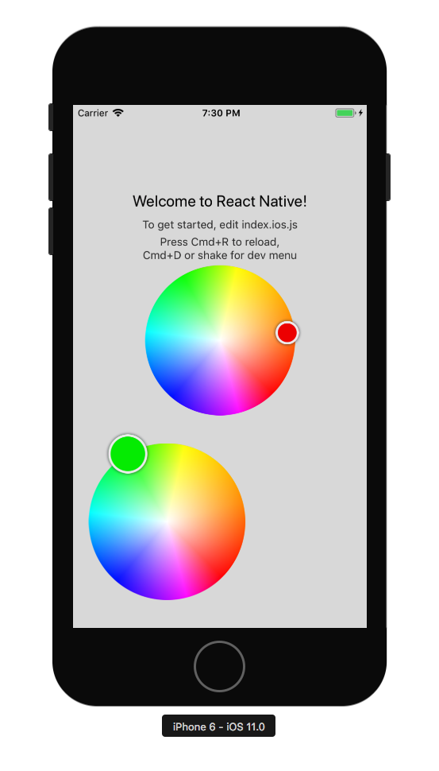

# react-native-color-wheel


:art: A react native reusable and color picker wheel

## Usage

```javascript
import React, { Component } from 'react';
import { Dimensions, StyleSheet, View } from 'react-native';
import { ColorWheel } from 'react-native-color-wheel';

const Example = ({onChange}) => (
  <View style={{flex: 1}}>
    <ColorWheel
      initialColor="#ee0000"
      onColorChange={color => console.log({color})}
      onColorChangeComplete={color => onChange(color)}
      style={{width: Dimensions.get('window').width}}
      thumbStyle={{ height: 30, width: 30, borderRadius: 30}}
    />
    <ColorWheel
      initialColor="#00ee00"
      style={{ marginLeft: 20, padding: 40, height: 200, width: 200 }}
    />
  </View>
);
```

## Props

| Name                    | Description                                    | Type   |
|-------------------------|------------------------------------------------|--------|
| `initialColor`          | Initial value in hex format                    | String |
| `onColorChange`         | Callback when the value is changed or moved    | func   |
| `onColorChangeComplete` | Callback on mouseup or drag event has finished | func   |
| `thumbSize`             | Width of draggable thumb                       | Number |
| `thumbStyle`            | CSS for the draggable thumb                    | Object |



PRs and issues are more than welcome.

<a href="https://getyeti.co" target="_blank">
   
</a>

> This package powers [Yeti Smart Home](https://getyeti.co) and is used in production.
Follow us in Github or https://twitter.com/netbeast_co.
